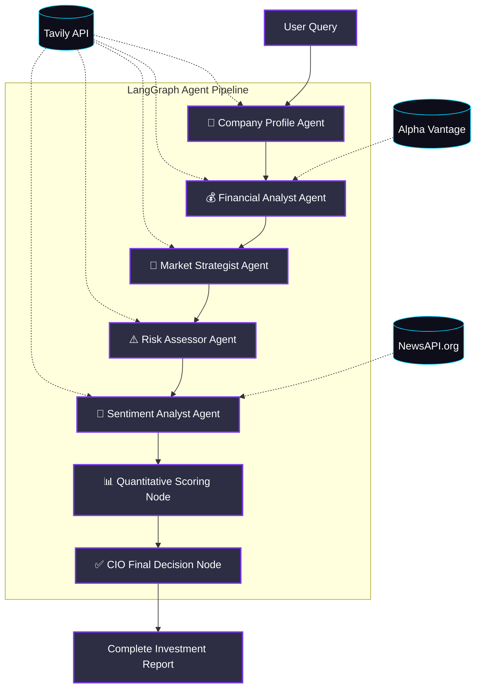

<div align="center">
  
  <h1>AI Investment Research Agent</h1>
  <p><strong>Autonomous multi-agent financial analyst built with Next.js, LangGraph, and Gemini 2.0</strong></p>

  [](https://nextjs.org/)
  [](https://www.typescriptlang.org/)
  [](https://langchain-ai.github.io/langgraphjs/)
  [](https://aistudio.google.com/)
</div>

<br />

> **Note**: This project was developed as a take-home assignment for the **AI Product Development Engineer Intern** position at **InsideIIM × Altuni AI Labs**.

## 📑 Table of Contents
1. [Executive Summary](#-executive-summary)
2. [Key Features](#-key-features)
3. [Architecture & Workflow](#-architecture--workflow)
4. [Tech Stack](#-tech-stack)
5. [Local Setup & Installation](#-local-setup--installation)
6. [API Reference](#-api-reference)
7. [Future Enhancements](#-future-enhancements)

---

## 🚀 Executive Summary

The **AI Investment Research Agent** is a production-grade web application that automates deep institutional investment research. Given a company name, it orchestrates a **7-node LangGraph pipeline** to fetch, synthesize, and evaluate real-time data across financial metrics, market positioning, risk factors, and news sentiment. 

It concludes with a definitive **INVEST / PASS** recommendation backed by an explainable thesis and quantitative scores, all delivered to the frontend via real-time **Server-Sent Events (SSE)**.

---

## ✨ Key Features

- **🧠 Multi-Agent Orchestration**: Utilizes LangGraph to structure the LLM's reasoning into 7 distinct, sequential tasks, drastically reducing hallucinations and improving analytical depth.
- **⚡ Real-Time Streaming (SSE)**: The frontend doesn't wait for the entire analysis to finish. As each agent node completes its task, the UI updates instantly via SSE.
- **📊 Quantitative Synthesis**: Converts unstructured qualitative text (news, risks, market data) into structured JSON with normalized 0-100 scores.
- **🎨 Premium UI/UX**: A highly responsive, glassmorphic dark-mode dashboard with animated SVG score gauges, pipeline progress trackers, and expanding report cards.
- **🔗 100% Traceability**: Every piece of data is backed by a citation linked directly to the source (Tavily, Alpha Vantage, NewsAPI).

---

## 🏗 Architecture & Workflow

The core intelligence is powered by a **State Graph**. Each node is a specialized agent that mutates a shared state object before passing it to the next node.



### The 7 Stages of Reasoning:
1. **Company Research**: Extracts industry, business model, and key products.
2. **Financial Analysis**: Pulls TTM (Trailing Twelve Months) revenue, margins, EPS, and calculates financial health.
3. **Market Analysis**: Evaluates Total Addressable Market (TAM), growth rates, and identifies key competitors.
4. **Risk Assessment**: Categorizes material risks (Regulatory, Financial, Macro) by severity.
5. **News & Sentiment**: Evaluates recent press for growth signals vs. negative events, calculating a sentiment score (-1 to 1).
6. **Scoring Engine**: Synthesizes the previous 5 nodes into distinct 0-100 scores.
7. **Final Decision**: Evaluates the quantitative scores against a strict framework to issue an INVEST/PASS mandate.

---

## 🛠 Tech Stack

### Frontend
- **Framework**: Next.js 15 (App Router)
- **Library**: React 19
- **Styling**: Vanilla CSS (CSS Variables, Flexbox/Grid, Keyframe Animations)
- **State**: React Hooks (`useState`, `useEffect`, `useRef`)

### Backend & AI
- **API**: Next.js Route Handlers (Edge-compatible streaming)
- **Agent Orchestration**: LangGraph.js + LangChain.js
- **LLM**: Google Gemini 2.0 Flash (`@langchain/google-genai`)
- **Type Safety**: Strict TypeScript interfaces bridging the frontend and LangGraph state.

### Data Sources
- **Tavily Search API**: Advanced AI-optimized web scraping and search.
- **Alpha Vantage API**: Fundamental quantitative market data.
- **NewsAPI.org**: Aggregation of recent news publications.

---

## 💻 Local Setup & Installation

### Prerequisites
- Node.js 18.17 or later
- API Keys for Gemini and Tavily

### 1. Clone the repository
```bash
git clone https://github.com/ruthwik-thotapelli/ai-investment-research-agent.git
cd ai-investment-research-agent
```

### 2. Install dependencies
```bash
npm install
```

### 3. Configure Environment Variables
Copy the example environment file:
```bash
cp .env.example .env.local
```
Open `.env.local` and add your API keys:
- `GEMINI_API_KEY`: Get from [Google AI Studio](https://aistudio.google.com/) *(Required)*
- `TAVILY_API_KEY`: Get from [Tavily](https://tavily.com/) *(Required)*
- `ALPHA_VANTAGE_API_KEY`: Get from [Alpha Vantage](https://www.alphavantage.co/) *(Optional but highly recommended)*
- `NEWS_API_KEY`: Get from [NewsAPI.org](https://newsapi.org/) *(Optional)*

### 4. Run the development server
```bash
npm run dev
```
Navigate to `http://localhost:3000` to start researching!

---

## 📡 API Reference

### `POST /api/research`
Triggers the LangGraph pipeline and opens an SSE stream.

**Request:**
```json
{
  "companyName": "Apple"
}
```

**Response (Server-Sent Events):**
The server streams progress updates in real-time as each LangGraph node completes.
```text
data: {"type":"overview","step":"financial_analysis","data":{"overview":{...}}}
data: {"type":"financial","step":"market_analysis","data":{"financial":{...}}}
...
data: {"type":"complete","step":"complete","data":{ /* Full InvestmentReport object */ }}
```

---

## 🔮 Future Enhancements
If given more time, I would expand this architecture with:
1. **Parallel Execution**: Run the Financial, Market, Risk, and News nodes concurrently using a parallel LangGraph routing node to reduce total latency by ~60%.
2. **PostgreSQL / Supabase Caching**: Store completed reports and raw API data to avoid redundant API calls for recently searched companies.
3. **PDF Export**: Generate a highly-styled, downloadable PDF version of the final JSON report using `@react-pdf/renderer`.
4. **Peer Comparison**: Allow users to input two tickers to run parallel agent pipelines and output a comparative analysis.

---
<div align="center">
  <i>Designed and developed by Ruthwik Thotapelli.</i>
</div>
