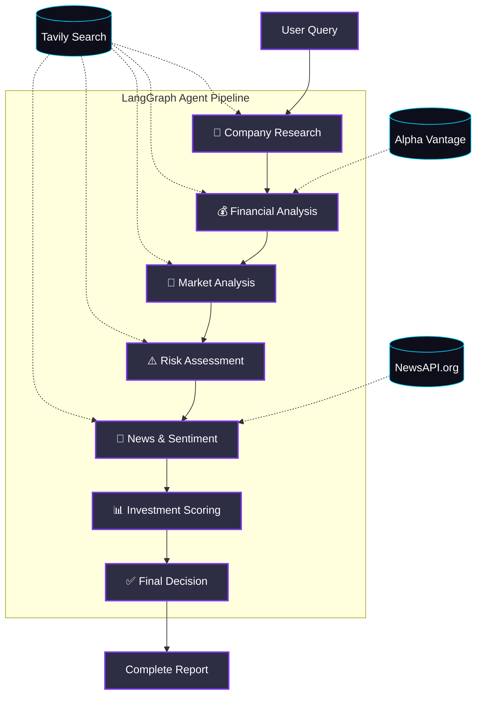

# 📈 AI Investment Research Agent


A production-quality, AI-powered Investment Research Agent built as a take-home assignment for Altuni AI Labs. It orchestrates a multi-agent reasoning pipeline to generate comprehensive, data-driven investment recommendations.

## 🌟 Overview

The AI Investment Research Agent takes a company name as input and performs deep, step-by-step research across multiple data sources. It synthesizes company profiles, financial metrics, market positioning, risk factors, and news sentiment to output a definitive **INVEST** or **PASS** recommendation, backed by quantitative scores and a detailed investment thesis.

### 🏗 Architecture

The core intelligence is powered by a **7-Node LangGraph StateMachine**. Each node represents a specialized sub-agent that adds specific insights to the shared state.



## 🛠 Tech Stack

| Component | Technology |
|---|---|
| **Framework** | Next.js 15 (App Router) + React 19 |
| **Language** | TypeScript (Strict Mode) |
| **Agent Orchestration** | LangGraph.js + LangChain.js |
| **LLM Engine** | Google Gemini 2.0 Flash (`@langchain/google-genai`) |
| **Data Sources** | Tavily Search, Alpha Vantage, NewsAPI.org |
| **Real-time Comms** | Server-Sent Events (SSE) Streaming API |
| **Styling** | Vanilla CSS (Dark Theme, Glassmorphism, Animations) |

## ✨ Features

- **Multi-Agent Pipeline**: 7 sequential specialized reasoning nodes.
- **Real-Time Streaming**: Watch the AI "think" in real-time via SSE progress tracking.
- **Quantitative Scoring**: Generates 5 key scores (0-100) using LLM synthesis (Investment, Risk, Growth, Sentiment, Financial Health).
- **Beautiful UI**: Premium dark mode design with glassmorphic cards and animated SVG score gauges.
- **Citation Tracking**: Fully transparent source tracking for all data points.
- **Resilient**: Granular error handling at the node level prevents total pipeline failure.

## 🚀 Getting Started

### Prerequisites
- Node.js 18+
- API Keys for Gemini and Tavily (required)
- API Keys for Alpha Vantage and NewsAPI (optional but recommended)

### 1. Clone & Install
```bash
git clone https://github.com/ruthwik-thotapelli/ai-investment-research-agent.git
cd ai-investment-research-agent
npm install
```

### 2. Environment Setup
Copy the template and fill in your API keys:
```bash
cp .env.example .env.local
```
Required keys:
- `GEMINI_API_KEY`: Get from [Google AI Studio](https://aistudio.google.com/)
- `TAVILY_API_KEY`: Get from [Tavily](https://tavily.com/)

Optional keys (improves data quality):
- `ALPHA_VANTAGE_API_KEY`: Get from [Alpha Vantage](https://www.alphavantage.co/)
- `NEWS_API_KEY`: Get from [NewsAPI.org](https://newsapi.org/)

### 3. Run Development Server
```bash
npm run dev
```
Open [http://localhost:3000](http://localhost:3000) to view the application.

## 🧠 Agent Workflow Explained

1. **Company Research**: Uses Tavily to extract a structured profile (Industry, CEO, Business Model, Key Products).
2. **Financial Analysis**: Fetches quantitative metrics from Alpha Vantage (Revenue, EPS, Margins, Market Cap) and synthesizes a financial summary.
3. **Market Analysis**: Analyzes TAM (Total Addressable Market), growth rate, key competitors, and competitive advantages.
4. **Risk Assessment**: Categorizes material risks (Regulatory, Financial, Macro) with severity levels.
5. **News & Sentiment**: Pulls recent articles via NewsAPI, scoring overall sentiment and identifying growth signals vs. negative events.
6. **Investment Scoring**: An LLM synthesizes all collected context into 5 distinct quantitative scores (0-100 scale).
7. **Final Decision**: Acts as a Chief Investment Officer, evaluating the scores to output a definitive INVEST or PASS recommendation with a detailed thesis, strengths, and weaknesses.

## 📡 API Reference

### `POST /api/research`
Initiates the research pipeline and streams Server-Sent Events (SSE).

**Request Body:**
```json
{
  "companyName": "Apple"
}
```

**SSE Event Types Streamed:**
- `overview`: Emitted after Company Research completes.
- `financial`: Emitted after Financial Analysis completes.
- `market`: Emitted after Market Analysis completes.
- `risk`: Emitted after Risk Assessment completes.
- `news`: Emitted after News Analysis completes.
- `scores`: Emitted after Scoring completes.
- `decision`: Emitted after Final Decision completes.
- `complete`: Emitted when the entire pipeline finishes successfully.
- `error`: Emitted if a fatal error occurs.

## 🔮 Future Improvements
Given more time, the following enhancements would be added:
- **Multi-Agent Parallelism**: Run Financial, Market, and Risk nodes concurrently to reduce total latency.
- **Historical Backtesting**: Compare the agent's historical recommendations against actual stock performance.
- **PDF Export**: Generate a downloadable, styled PDF report.
- **Caching/Database**: Store previous analyses in PostgreSQL/Supabase to avoid redundant API calls.

## 📄 License
MIT License
